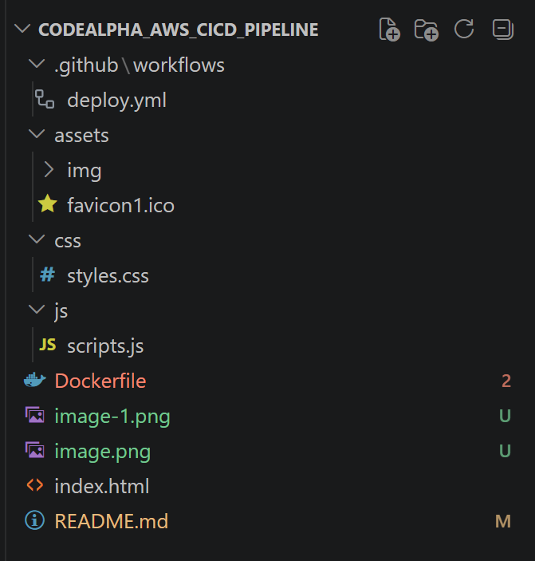
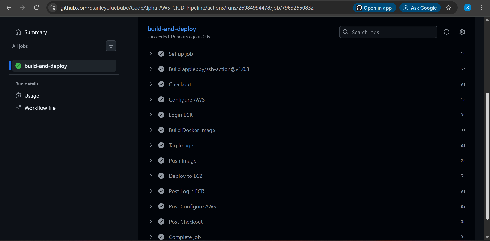
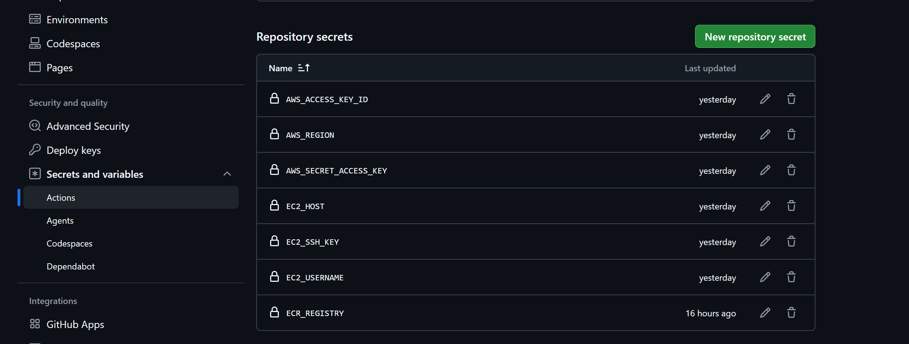
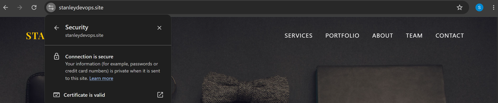
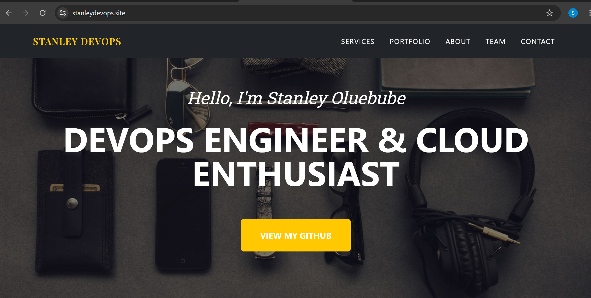
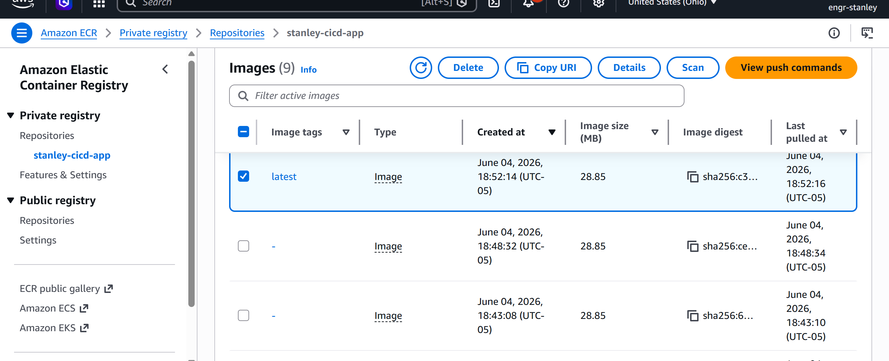
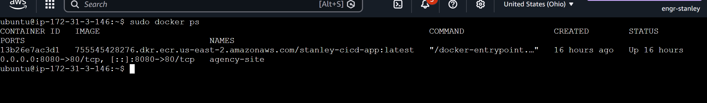

# 🚀 CI/CD Pipeline for Portfolio Website Deployment (AWS Implementation)

## 📌 Project Overview

This project demonstrates the implementation of a complete CI/CD pipeline for automated website deployment. Although the original internship task required the use of Azure DevOps services, AWS services were used as an alternative due to the absence of an Azure subscription while still achieving the same DevOps objectives.

The project automates the process of building, containerizing, storing, and deploying a portfolio website whenever code changes are pushed to GitHub.

--------------------------------------------

## 🎯 Original Task Objectives

The task required:

* Build an automated CI/CD pipeline using Azure Pipelines
* Store container images in Azure Container Registry (ACR)
* Deploy applications automatically via Azure App Service
* Monitor pipeline execution
* Learn and apply DevOps automation concepts

### Alternative AWS Implementation

| Azure Service                  | AWS Equivalent Used                     |
| ------------------------------ | --------------------------------------- |
| Azure Pipelines                | GitHub Actions                          |
| Azure Container Registry (ACR) | Amazon Elastic Container Registry (ECR) |
| Azure App Service              | Amazon EC2                              |
| Azure Monitoring               | GitHub Actions Monitoring & Logs        |

--------------------------------------------

## 🏗️ Architecture

Developer
    │
    ▼
GitHub Repository
    │
    ▼
GitHub Actions Workflow
    │
    ▼
Docker Build
    │
    ▼
Amazon ECR
    │
    ▼
Amazon EC2
    │
    ▼
Docker Container
    │
    ▼
Nginx Web Server
    │
    ▼
HTTPS Portfolio Website

--------------------------------------------

## 🛠️ Technologies Used

### Cloud Platform

* AWS

### CI/CD

* GitHub Actions

### Containerization

* Docker

### Container Registry

* Amazon ECR

### Deployment Platform

* Amazon EC2

### Web Server

* Nginx

### Security

* SSL/TLS Certificate
* Certbot
* HTTPS

### Version Control

* Git
* GitHub

--------------------------------------------

## 📂 Project Structure

CODEALPHA_AWS_CICD_PIPELINE/
│
├── .github/
│   └── workflows/
│       └── deploy.yml
│
├── assets/
├── css/
│   └── styles.css
├── js/
│   └── scripts.js
│
├── Dockerfile
├── index.html
└── README.md

--------------------------------------------

## ⚙️ Docker Configuration

The application is containerized using Docker and served through Nginx.

### Dockerfile

*Dockerfile*

FROM nginx:alpine

COPY . /usr/share/nginx/html

EXPOSE 80

CMD ["nginx", "-g", "daemon off;"]

--------------------------------------------

## 🔁 CI/CD Workflow

The GitHub Actions workflow performs the following tasks automatically:

# 1. Source Code Checkout

Pulls the latest code from GitHub.

# 2. AWS Authentication

Authenticates GitHub Actions with AWS using IAM credentials.

# 3. Login to Amazon ECR

Authenticates Docker with Amazon Elastic Container Registry.

# 4. Build Docker Image

Builds a new Docker image from the application source code.

# 5. Push Image to Amazon ECR

Stores the latest container image in Amazon ECR.

# 6. Deploy to EC2

Connects securely to the EC2 instance via SSH and deploys the latest Docker image automatically.

--------------------------------------------

## 🔐 GitHub Secrets Configuration

The following secrets were configured in GitHub Actions:

AWS_ACCESS_KEY_ID
AWS_SECRET_ACCESS_KEY
AWS_REGION
EC2_HOST
EC2_USERNAME
EC2_SSH_KEY
ECR_REGISTRY

--------------------------------------------

## 🌐 Domain & HTTPS Configuration

A custom domain was configured:

https://stanleydevops.site

SSL/TLS encryption was enabled using:

* Certbot
* Let's Encrypt Certificates

Benefits:

* Secure communication
* HTTPS encryption
* Improved browser trust
* Production-ready deployment

--------------------------------------------

## 📧 Contact Form Integration

The portfolio website includes a functional contact form powered by StartBootstrap SB Forms.

Features:

* Real-time form submission
* Email notifications
* User-friendly contact experience

--------------------------------------------

## Key Achievements

✅ Built a fully automated CI/CD pipeline

✅ Containerized application using Docker

✅ Stored container images in Amazon ECR

✅ Automated deployment to Amazon EC2

✅ Configured GitHub Actions workflow

✅ Enabled HTTPS using SSL/TLS

✅ Connected custom domain

✅ Implemented a functional contact form

✅ Learned real-world DevOps deployment practices

✅ Applied Infrastructure Automation principles

--------------------------------------------

## 📸 Additional Screenshots 

--------------------------------------------

## 📚 Lessons Learned

Throughout this project, I gained practical experience in:

* Continuous Integration (CI)
* Continuous Deployment (CD)
* Docker Containerization
* AWS Cloud Services
* GitHub Actions Automation
* Amazon ECR
* Amazon EC2
* Domain Configuration
* SSL/TLS Security
* Production Deployment Workflows
* Troubleshooting CI/CD Pipelines

--------------------------------------------

## 👨‍💻 Author

**Stanley Oluebube**

DevOps Engineer | Cloud Enthusiast | AWS Practitioner

🌐 Website: [https://stanleydevops.site](https://stanleydevops.site)

📧 Contact: Stanleyoluebube171@gmail.com

🔗 LinkedIn: [https://www.linkedin.com/in/stanley-oluebube-igboji-42098b361?utm_source=share&utm_campaign=share_via&utm_content=profile&utm_medium=ios_app]

--------------------------------------------

### Note

Although the original task specified Azure DevOps services, this implementation successfully demonstrates the same CI/CD concepts and automation workflow using AWS services, GitHub Actions, Docker, Amazon ECR, and Amazon EC2. The objective of understanding and implementing end-to-end DevOps automation was fully achieved.

